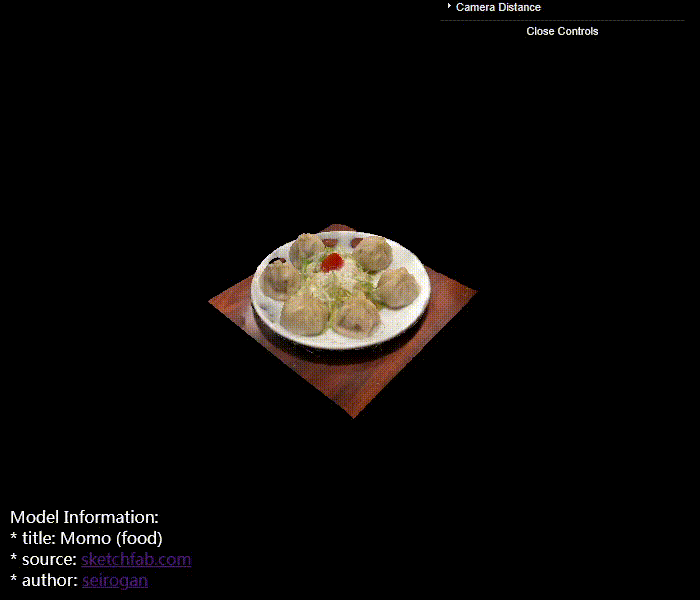

This will start a Vite development server accessible at `http://localhost:5173` and on your local network.

## Project Structure

- `main.js` - Main entry point

## Dependencies

- [Three.js](https://threejs.org/) - 3D graphics library
- [dat.gui](https://github.com/dataarts/dat.gui) - Lightweight controller library
- [Vite](https://vitejs.dev/) - Next generation frontend tooling

## Record

